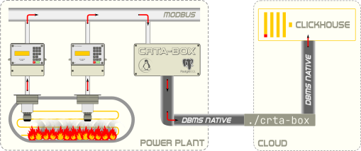

# crta-box

[](https://opensource.org/licenses/MIT)

Industrial monitoring systems for power plants. Stream data from acoustic-based *culvert rupture telltale aggregation* boxes (*CRTA-BOX*es) (to target [ClickHouse](https://clickhouse.com/)-database).

## Usage

||
|:--:|
| **Figure**: `crta-box` usage concept|

### Basics

To start streaming data from *CRTA-BOX* to *ClickHouse*-database execute

```shell
./crta-box stream <access-options>
```

where a full set of `<access-options>` could be listed by executing

```shell
./crta-box stream --help
```

Optionally they could check access to *CRTA-BOX* with

```shell
./crta-box box <access-options>
```

or *ClickHouse*-database with

```shell
./crta-box house <access-options>
```

where appropriate `<access-options>` could be listed with `--help`:

```shell
./crta-box box --help && ./crta-box house --help
```

> &#8505; On *Windows&#8482;* use `.\crta-box.exe` command call.

### Logging

Enforce logging to file by adding `--log=<FILE>` option before command:

```bash
./crta-box --log=crta-box.log stream <access-options>
```

## Installation

### Prerequisites

For operability of `crta-box`, it is necessary not only to have valid access options but also the correct organization of the table structure in both communicating systems. While the data structure in *ClickHouse* can be drawn up from a [ch__create-table__log_box3.sql](share/house/ch__create-table__log_box3.sql), the structure of the tables in the *CRTA-BOX* is determined by the current version of the installed telltale boxes. In order to provide erroneous execution of `crta-box` there must be some data in *ClickHouse*-database that could be inserted by provided [ch__insert-table__log_box3.sql](share/house/ch__insert-table__log_box3.sql).

### Installation process

#### Linux (amd64)

Set the tag for the latest [Release](https://github.com/omega1x/crta-box/releases), i.e.:

```shell
tag=v0.0.1
```

Install the tagged version:

```shell
wget \
-O crta-box \
-o download.log \
--show-progress \
https://github.com/omega1x/crta-box/releases/download/$tag/crta-box-linux-amd64 \
 \
&& cat download.log && rm download.log \
&& chmod +x crta-box
```

Then check installation:

```shell
./crta-box --version
```

#### Windows (amd64)

Set the tag for the latest [Release](https://github.com/omega1x/crta-box/releases), i.e.:

```powershell
# powershell:
$tag = "v0.0.1"
```

Install the tagged version:

```powershell
# powershell:
Invoke-WebRequest -Uri "https://github.com/omega1x/crta-box/releases/download/$tag/crta-box-windows-amd64" -OutFile 'crta-box.exe'
```

Then check installation:

```shell
# powershell or cmd:
./crta-box.exe --version
```

## Change Log

- *v0.0.3* - unify revision-3.3 data source for all  current versions of *crta-boxes*,
- *v0.0.2* - solve some lint issues,
- *v0.0.1* - first working binary.
