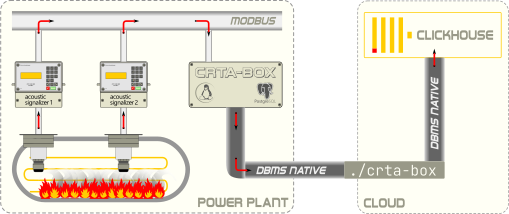

# crta-box

[](https://opensource.org/licenses/MIT)

Industrial monitoring systems for power plants. Stream data from acoustic-based *culvert rupture telltale aggregation* boxes (*CRTA-BOX*es) to the dedicated [ClickHouse](https://clickhouse.com/)-database.

## Usage

### Concept

||
|:--:|
| **Figure**: `crta-box` usage concept|

### Basics

To start streaming data from *CRTA-BOX* to *ClickHouse*-database execute

```shell
./crta-box stream <access-options>
```

where a full set of `<access-options>` could be listed by executing

```shell
./crta-box stream --help
```

> [!WARNING]
>
> Although it is possible, streaming data from different *CRTA-BOX* servers to the same table in the *ClickHouse*-database is a bad practice. Use individual `house_table` for each running `crta-box stream` instance.

Optionally they could check access to *CRTA-BOX* server with

```shell
./crta-box box <access-options>
```

or *ClickHouse*-database with

```shell
./crta-box house <access-options>
```

where appropriate `<access-options>` could be listed with `--help`:

```shell
./crta-box box --help && ./crta-box house --help
```

> [!NOTE]
>
> On *Windows&#8482;* use `.\crta-box.exe` command call.

### Logging

Enforce logging to file by adding `--log=<FILE>` option before command:

```bash
./crta-box --log=crta-box.log stream <access-options>
```

## Installation

### Prerequisites

For operability of `crta-box` command line utility, it is necessary not only to have valid access options but also the correct organization of the table structure in both communicating systems: a *CRTA-BOX* server and a [ClickHouse](https://clickhouse.com/docs/getting-started/quick-start))-database.

#### View *box_view*

All modifications of the *CRTA-BOX*es should have a unified `box_view`-view  that combines data from acoustic sensors of all possible versions (revisions).

> [!NOTE]
>
>For the newest versions of *CRTA-BOX*, `box_view` is provided as an out-of-the-box feature by vendor.

#### Database *BOXes*

The receiver of data from *CRTA-BOX* server is the database named `BOXes` inside the ([ClickHouse](https://clickhouse.com/docs/getting-started/quick-start))-database, that contains individual tables mirroring the `box_view` for each instance of *CRTA-BOX* server. An example of a [ClickHouse](https://clickhouse.com/docs/getting-started/quick-start)-database deployment can be found in the [deploy-example.py](.share/ch/deploy-example.py)-script.

> [!Note]
>
> Edit `HOST_IP` value in [deploy-example.py](.share/ch/deploy-example.py) before run it to make [ClickHouse](https://clickhouse.com/docs/getting-started/quick-start)-database reachable for the `crta-box stream` process.

The structure of mirroring tables is provided in [create-table.sql](.share/ch/create-table.sql)-script. You may run the next command to organize example mirroring table:

```bash
clickhouse-client --host $HOST_IP --port 29000 --user user --password pass --queries-file .share/ch/create-table.sql 
```

### Installation process

#### Linux (amd64)

Set the tag for the latest [Release](https://github.com/omega1x/crta-box/releases), i.e.:

```shell
tag=v0.1.0
```

Install the tagged version:

```shell
wget \
-O crta-box \
-o download.log \
--show-progress \
https://github.com/omega1x/crta-box/releases/download/$tag/crta-box-linux-amd64 \
 \
&& cat download.log && rm download.log \
&& chmod +x crta-box
```

Then check installation:

```shell
./crta-box --version
```

#### Windows (amd64)

With [PowerShell](https://learn.microsoft.com/en-us/powershell/) set the tag for the latest [Release](https://github.com/omega1x/crta-box/releases), i.e.:

```powershell
$tag = "v0.1.0"
```

Install the tagged version:

```powershell
Invoke-WebRequest -Uri "https://github.com/omega1x/crta-box/releases/download/$tag/crta-box-windows-amd64" -OutFile 'crta-box.exe'
```

Then check installation:

```shell
./crta-box.exe --version
```

## Change Log

- *v0.1.0* - significant changes and additions due to the need to transfer data from sensors of all previous revisions:
  - data from *CRTA-BOX* server now is fetched from the unified `box_view`;
  - fetched data is streamed to individual tables created for each of *CRTA-BOX*es
  - pinging with `crta-box box` and `crta-box house` now can additionally show last record timestamps
    performing the whole connectivity path check implicitly.
- *v0.0.3* - unify sensor revision-gп3.3 data source for all current versions of *CRTA-BOX*es
- *v0.0.2* - solve some lint issues.
- *v0.0.1* - first working binary.
